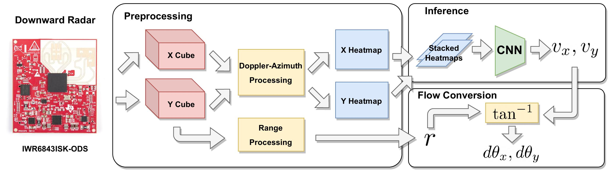

## BatMobility🦇 [MobiCom'23]
### [Paper](https://batmobility.github.io/sie2023batmobility.pdf) | [arXiv](TBD) | [Project Page](https://batmobility.github.io)

This is a Pytorch implementation of the radio flow module from the following paper: <br/>
> **BatMobility: Towards Flying Without Seeing for Autonomous Drones**  
> Emerson Sie, Zikun Liu, Deepak Vasisht    
> *ACM International Conference on Mobile Computing and Networking (MobiCom), 2023* 
>

---



https://github.com/ConnectedSystemsLab/batmobility_ae/assets/14133352/3a7fa785-f5d9-4c83-8ec6-324ddeba491e

#### 1. Requirements and Dependencies
This code is tested on Ubuntu 18.04 and requires an NVIDIA GPU (we use an RTX 3090).

To setup the dependencies, create and activate the conda environment.
```
conda create env -f env.yaml
conda activate batmobility_ae
```

#### 2. Evaluation 
The [test dataset](https://uofi.box.com/s/yn4k8m11iann3ky2e9wivgjd7u43wfk6) includes the pre-trained models and test data used to generate the main results in the paper. The structure is as follows:
```
test_data/
|-- v4/               # This corresponds to the 15 Hz model described in the paper.
|-- v5/               # This corresponds to the 30 Hz model described in the paper.
|-- v6/               # This corresponds to the 40 Hz model described in the paper.
|   |-- v6_model.pth
|   |--  *.bag
```

Download the `.zip` file and unzip in this directory.
```
unzip test_data.zip
```

To test each pre-trained model on its corresponding test set, run
```
./main_eval.py
```

For each test `.bag` in each folder the script generates a plot showing a comparison between the corresponding model and the commercial optical flow sensor (PMW3901). In addition to the plot, the raw outputs of the model are also saved as `.npz` files.

#### 3. Training
We also provide a [larger dataset](https://uofi.box.com/s/mf5qjobkfi3wwlb7es2kii77744bgxvg) (~30 GB) to train models from scratch. It consists of a set of `.bag` files split into training and validation sets for each model. 
```
train_data/
|-- v4/
|-- v5/
|-- v6/
|   |-- train/        # Contains .bags for training
|   |-- test/         # Contains .bags for validation
```

Download the `.zip` file and unzip in this directory.
```
unzip train_data.zip
```

To train the models, run
```
./main_train.py
```
The models and training curve plots will be generated in separate folders. 

### Citation

If you found this repository useful, please consider citing the paper:

```bibtex
@inproceedings{sie2023batmobility,
  author    = {Sie, Emerson and Liu, Zikun and Vasisht, Deepak},
  title     = {BatMobility: Towards Flying Without Seeing for Autonomous Drones},
  booktitle = {ACM International Conference on Mobile Computing (MobiCom)},
  year      = {2023},
  doi       = {https://doi.org/10.1145/3570361.3592532},
}
```

